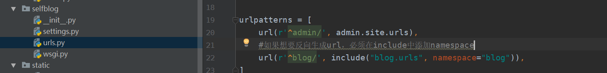
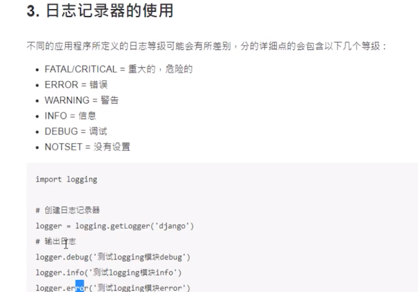

# 项目实操

项目开发：

用户认证（短信验证、图形验证码、djangoModelForm组件）

wiki、文件、问题管理

支付、部署

## 1、准备工作

### 1.1虚拟环境

```
1、安装：pip install virtualenv
2、创建虚拟环境： 
	virtualenv 环境名称 
/   virtualenv 环境名称 --python==python3.7 创建一个文件夹
3、激活虚拟环境：
	进入虚拟环境目录下的Script目录  
	执行activate.bat进行激活， 执行deactivate.bat进行对出
4、在虚拟环境中安装模块
	pip install django==1.11.28
```

### 1.2、搭建项目环境

```
使用pycharm创建新的项目时，编译器选择虚拟环境中的python.exe
```

### 1.3、本地配置

```python
1、在setting中导入本地配置（比如数据库之类的）
    try:
        from .local_settings import * 
    except ImportError: 
        pass
2、创建自己的本地配置
    #!/usr/bin/env python 
    # -*- coding:utf-8 -*-
    LANGUAGE_CODE = 'zh-hans' 
    SMS = 666
```

### 1.4、使用git管理项目

pip freeze > requirement.txt

pip install -r requirement.txt

day1任务： 使用python代码将文件上传到腾讯对象存储中


# errorList:

1、在反向生成url时出现： ``'blog' is not a registered namespace``

​	原因：没有在urls.py 的path()中的include内添加namespace属性



2、在执行 python manage.py makemigrations 时出现：

​	 ``Error loading MySQLdb module: No module named 'MySQLdb'``

​	解决方案：

​	安装pymysql： pip  install pymysql
​	在项目``/__init__.py``中添加如下内容

```python
import pymysql
pymysql.install_as_MySQLdb()
```

3、使用redis时 ： TCP listening socket *:6379: bind: No error

解决方案： 直接在命令行中输入redis-cli.exe ,执行以下操作

4、发现下载某个python包太慢：

使用``pip install -i `` +镜像源 + 需要安装的包即可

```
常用镜像源：
清华：https://pypi.tuna.tsinghua.edu.cn/simple
阿里云：http://mirrors.aliyun.com/pypi/simple/
中国科技大学 https://pypi.mirrors.ustc.edu.cn/simple/
华中理工大学：http://pypi.hustunique.com/
山东理工大学：http://pypi.sdutlinux.org/
豆瓣：http://pypi.douban.com/simple/
```



AttributeError: 'str' object has no attribute 'decode'：https://blog.csdn.net/qq_36274515/article/details/89043481

UnicodeDecodeError: 'gbk' codec can't decode byte 0xa6 in position 9737: ill....

前端界面“A server error occurred. Please contact the administrator.”


